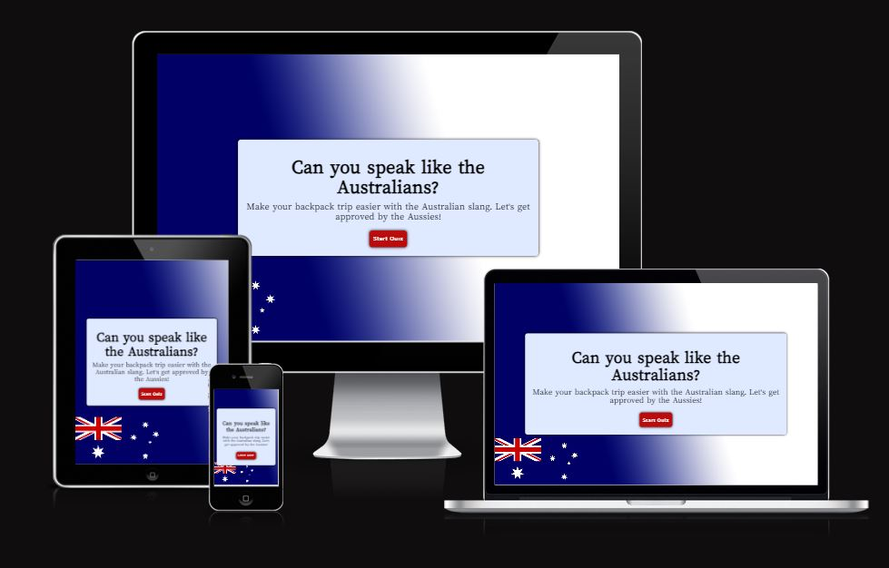
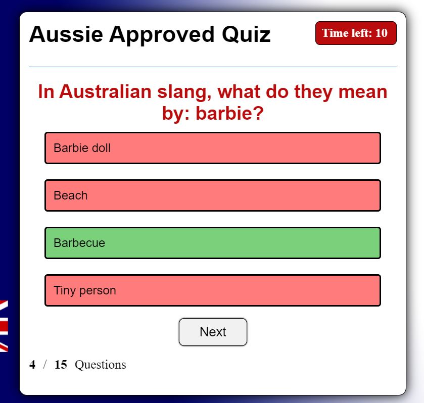

# Aussie Approved

Aussie Approved is a website that want to reach out to people that want to backpack Australia. In this website they will learn the Australian slang, so they are ready to fit in and get approved by the aussies!

## Design
### Color theme
I wanted the website to have the same theme through the whole process to make it more user friendly. I did that by having the same colors and background image in every step. I focused on having colors with good contrast for readability, for example blue and red. I also match the colors with the Australian flag to keep the theme of Australia. I used the colors black and white to have a nice structured layout.

The color palette was created using the [Colormind](https://colormind.io/) website.
### Typografi
Google fonts were used for the title in the home page. I choose 'Lisa Bosa' because I thought it looked playful, perfect for a quiz. I used the common Arial for titles in the rule, quiz and feedback box to make it easier to read, while it still dont look to serious. For the buttons and the rules text I used the defualt font Times New Roman. To make some contrats and have them more serious looking. 
## Features
### Home page
The home page is working fully responsively and has the same background like the rest of the pages. It has a small concrete sub heading that is telling the user what the website/quiz is for and how they can use knowledge from it in real life. The home page also have a Start Quiz button that has a hover on it and a pointer to make it easier for the user to understand that its something to click on.

### Rules page
A page where the user can see how the quiz is planned out.

### Quiz page
When the quiz starts the timer begins and they have 15 seconds to chose their answer. When an answer is selected the quiz give the user instant feedback if it was the correct or incorrect answer by the colors green for correct and red for incorrect. The user can also see in the bottom corner how many questions they have left. The next button dont show up until the user have chosen their answer to prevent cheating.

### Feedback page
When all the questions are answered 
## Existing features
## Feauture that could improve
## Testing
### Code validation
#### HTML
#### CSS
### Am I responsive
### Accessibility
## Unfixed bugs
# Fixed bugs
## Deployment
## Credits
### Content
### Media
## Acknowledgementes