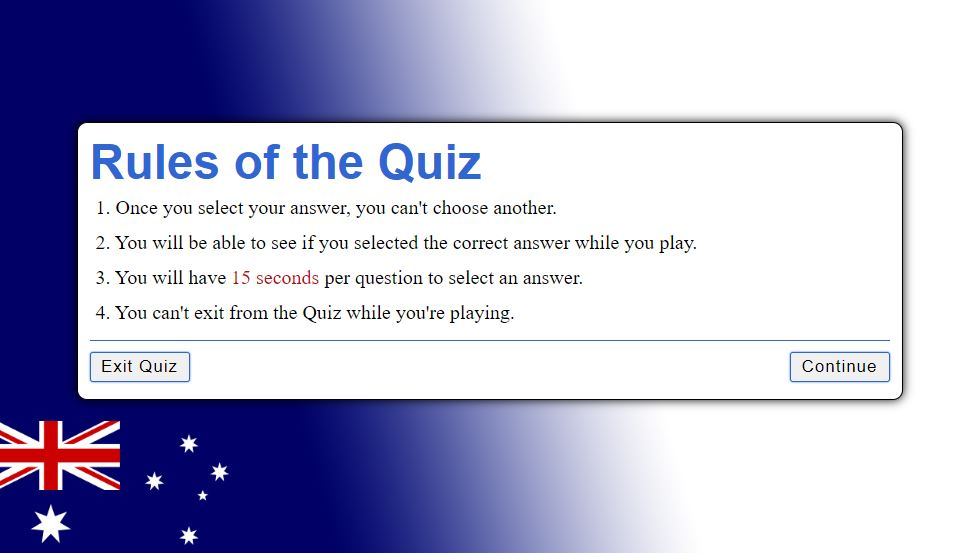

# Aussie Approved
Aussie Approved is a website with a quiz, that want to reach out to people that are planning to backpack Australia. In this website they will learn the Australian slang, so they are ready to fit in and get approved by the aussies!
It has 15 questions and have 4 diffrent options. The website is responsive and fit large screens, medium screens, tablets and phones. In the end of the quiz there will be a feedback page that tells the user how much they scored, also a quit button to return back to the home page.

[View the live project here.](https://klaramartinsson.github.io/aussie-approved/)

## User Experience

#### First user goals
This quiz is for people that want to backpack Australia and fit in easily. They will have a better chance at that by learning the aussie slangs that I use in this quiz.
- As a first time user, I want them to quickly understand what the webpage is about. 
- It should be an easy quiz where the user don't get confused by disturbing design or pop ups.
- The countent should be easy readable and with as litle grammatical mistakes as possible.
- Smooth navigation through the quiz.

#### Returning user goals
- Coming back to the quiz becauce they want a refresher.
- Coming back to show their friends and family.
- If I were to add high score and different levels of difficulty the user could challenge themself and their friends and family.

### Wireframes
I made wireframes to get an idea of how I wanted my website to turn out. I also made it to see how it would act with responsivness for better user experience. I changed the look of it to make it look more like you are on the same webpage when the quiz begins.

## Design

### Color theme
I wanted the website to have the same theme through the whole process to make it more user friendly. I did that by having the same colors and background image in every step. I focused on having colors with good contrast for readability, for example blue and red. I also matched the colors with the Australian flag to keep the theme of Australia. I used the colors black and white to have a nice structured layout.

The color palette was created using the [Colormind](https://colormind.io/) website.

### Typografi
[Google fonts](https://fonts.google.com/) were used for the title in the home page. I choose 'Lisa Bosa' because I thought it looked playful, perfect for a quiz. I used the common Arial for titles in the rule, quiz and feedback box to make it easier to read, while it still don't look to serious. For the buttons and the rules text I used the defualt font Times New Roman. To make some contrats and have them more serious looking.

## Features

### Existing features

- Nice layout that look similar on all of the pages.
- Responsive design from 320px and up.
- A funny quiz with aussie slangs that a first time backpacker would need for their trip to Australia.
- Easy navigation through all pages.
- Feedback for user to know which question where correct and how much they scored.
  
### Future features
- A page to store the users high score.
- A option to share your score for social media.
- Different levels of difficulty in the quiz.
  
### Home page
The home page is working fully responsively and has the same background like the rest of the pages. It has a small concrete sub heading that is telling the user what the website/quiz is for and how they can use knowledge from it in real life. The home page also have a Start Quiz button that has a hover on it and a pointer to make it easier for the user to understand that its something to click on.

### Rules page
A page where the user can see how the quiz is planned out.

### Quiz page
When the user clicked continue the quiz starts with a timer, they have 15 seconds to choose their answer. When an answer is selected the quiz give the user instant feedback if it was the correct or incorrect answer by the colors green for correct and red for incorrect. The user can also see in the bottom corner how many questions they have left. The next button don't show up until the user have chosen their answer to prevent cheating.

### Feedback page
When all of the questions are answered the user reach the feedback page where they get to know how much they scored in the quiz. 

## Testing
### Manual testing
- I been testing the website many times by playing the game. I also been asking friends and family to check it out.
* Checking that all the buttons works
* Make different choices in the quiz to see the colors for correct and incorrect answer.
* Looking at the feedback at the end of the quiz to see if it counts correct answers. 
* Checking that the timer works when quiz begins. Also see if new questions comes up when the timer is finished. 
* Looked at the background of the website that it's not pixeled or stretch out on any pages. Also that it has good contrast with text elements.
### Automated testing
- The website have been tested with W3C Validator, Jigsaw Validator, Js Hint, The Am I Responsive website, Google Chrome lighthouse and for console errors.
- All pages have been tested for screen sizes from 320px up to 1300px.
### Code validation
#### HTML
No errors where found in the code with the W3C Validator.
#### CSS
The code made it through Jigsaws validatore with no problems.
#### JavaScript
No warnings in JSHint validatore.
### Am I responsive
I looked at this [website](https://ui.dev/amiresponsive?url=https://8000-klaramartinsson-aussie-a-rpeqpg0a1z.us2.codeanyapp.com/index.html) when I was making media queries to make sure the webpage looked good on all screens.

### Accessibility
I used Google Chromes lighthouse to be sure of the accessiblity. All of the pages have a good accessibility score. More things I done for the acessibility are:
- My text colors have good contrast to the backgrounds.
- Using semantic HTML.
- A good overall contrast with my colors.
- No disturbing background images or fonts that makes the text difficult to read.
- All buttons have hover effect so the user will know when they can click something.

## Fixed bugs

After the time went down to 0 it started to count negative numbers. I fixed this by making an if statement in JavaScript. Now that the timer counts down it stops at 0. 

It was possible to press the next button in the quiz so you didnt have to choose an answer. I changed that by putting a hide class on the button and remove the class with an if statement when an answer is selected. 

Once the user run out of questions the game doesn't end. So I added the showFeedback function to run if the questions are done.

## Unfixed bugs
When you click on a option in the quiz the score goes up or down, making it easier to cheat. 

## Deployment
Git hub pages was used to deploy the live site as following:
- Log in to Git hub.
- Go to the GitHub repository [Aussie Approved](https://github.com/KlaraMartinsson/aussie-approved), navigate to settings.
- In the left-hand side navigation bar click pages.
- In the source section chose Main and select Root from the folder selection dropdown menu.
- Click on save and you then get the URL.
- All codes, files and images have been added in Github by using Git commands: git add ., git commit -m and git push.

## Credits
### Content
- The content from the quiz is from [Australia day](https://www.australiaday.com.au/fun-activities/take-the-aussie-slang-quiz/), [Insiders guides](https://insiderguides.com.au/aussie-slang-test/) or by myself.

### Media
I made the background image myself in Photoshop with the australian flag that I took from [Pixabays website](https://pixabay.com/) I also took my icon for the browser tab from Pixabay. I used [Font Awesome](https://fontawesome.com/) for the feedback icon with the trophie.

### Code used
I used a video from [Web Dev Simplified](https://www.youtube.com/watch?v=riDzcEQbX6k) as tutorial for the backbone of the JavaScript. I also used a video from [Coding Nepal](https://www.youtube.com/watch?v=WUBhpSRS_fk&t=0s) for knowledge about counting questions in the quiz. I got help with the timer from [Reach Star](https://www.youtube.com/watch?v=4piMZDO5IOI)
The code snippet to create the shadows around the containers and buttons was learnt from this [CSS leason](https://www.w3schools.com/css/css3_shadows.asp).

## Acknowledgementes
- My family and friends for checking out the webpage on their screens and giving critic.
- My mentor Seun for giving helpful advise about the design.
